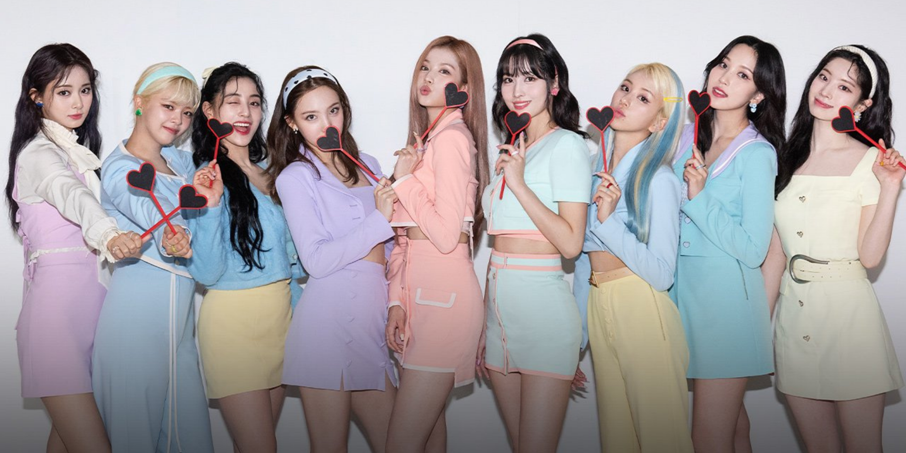

# ID-Assignment-1

ID Assignment 1
This ID assignment's Website will be about Twice

# Background

Background about Twice. Twice is a 9 member girl group, debuted on October 20th 2015, with their first EP (Extended Play something with more tracks compared to a Single and less compared to an Album) The Story Begins with their lead single being, Like Ooh Ahh. The formation of the group happened through a competition survival show called Sixteen. It was named Sixteen as there were sixteen competitors. Eventually, the group was formed with 7 members, Jihyo, Jeongyeon, Nayeon, Chaeyoung, Mina, Sana, Dahyun and 2 more, Tzutu and Momo were added by Park Jin-young, the CEO of JYPE one of the big 3 KPOP entertainment agency.

## Reasons for using Twice as assignment

I decided to do my assignment based on Twice as I fell in love with their music back in 2017 when my classmate introduced me to their newest song at that time, Signal. The song got me hooked to the group up till now 2022.

## Who the site is made for

The website is mainly made for newer Twice fans that wants to know a little more about their new interest girl group. This website allows them to not only see who each members are, being able to get their official solo and group Instagram handles without taking abit of time to filter througn all the fan insta pages that have been set up by their lovely fans. The website also aims to help newer fans in figuring out how many korean singles Twice have so far and by descending order.

The Website also caters for returning fans, who stopped listening to Twice for a while, and is curious about how many songs the Girl Group have released so far.

# All HTML pages

This Website will be split into 5 different html files, namely Mainpage, Members, History, Photo Gallery and Music Videos

## Mainpage

This page will be the first page that a potential user might see. It includes a navigation bar which can be used to move through all the pages, a background image of Twice as a whole group as well as a footer which includes their group social links like instagram, youtube and their official site. The footer also includes a link for the jypnation mobile game to both the apple store and the google playstore that the user can download and play rythm games with twices songs or any other groups that is under JYP like Twice, ITZY, NMixx and Stray kids.

## Members

This page will basically be like a meet the members page, it includes a picture of them, their name, age, brithday, role in Twice as well as a button that will bring them to the members instagram page when clicked

## History

This page includes the basic history of Twice from the Sixteen Era all the way till now 2022.

## Photo Gallery

This page showcases some of their concept photos taken for their previous albums and are shown based on tens, 9 individual photos and 1 group photo. when clicked, the images will pop out.

## Music Videos

This page lists and shows all Korean Music videos they have up till noe (2022) from their first single, Like Ooh Ahh up till the newest, Talk that Talk.

# References

## All Links used
